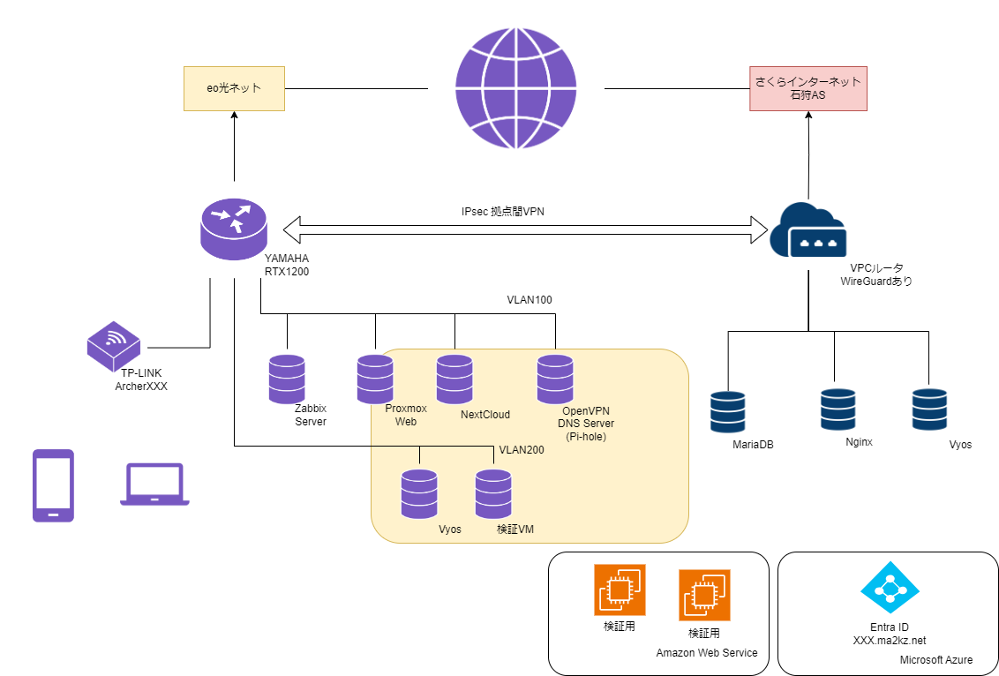
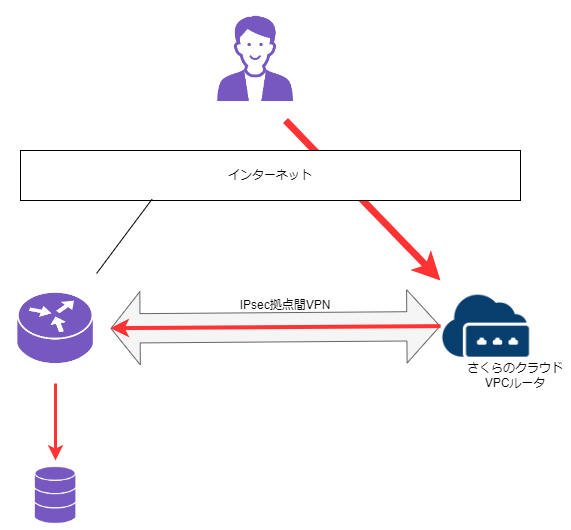
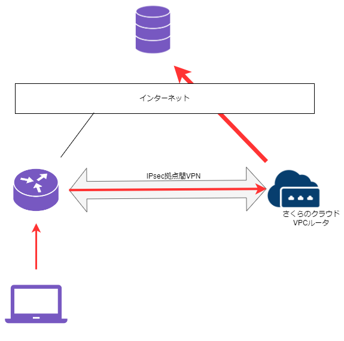
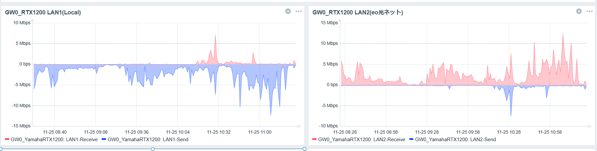
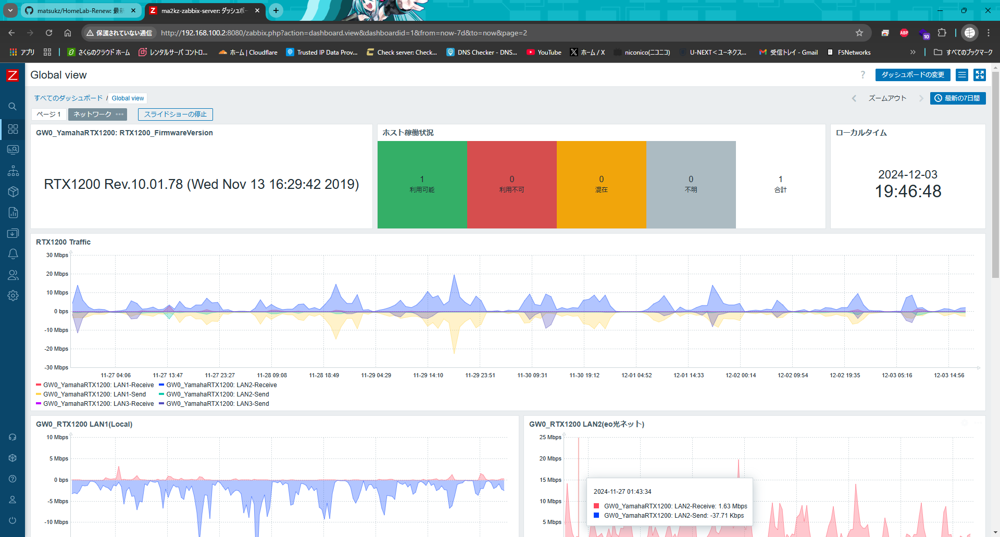
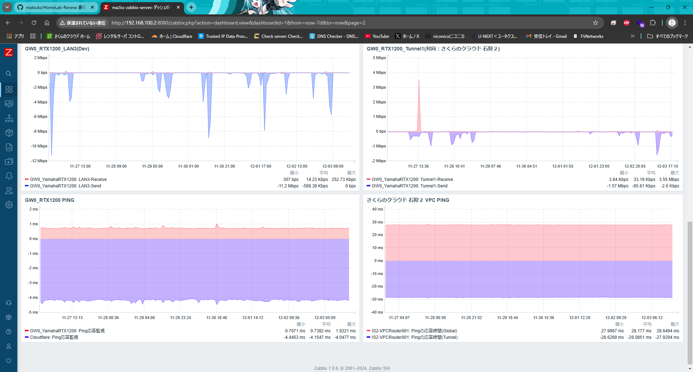

# HomeLab-Renew
最新の自宅サーバー事情
* 2024年11月現在の自宅サーバー事情についてです！


## それぞれの紹介

### 全体
自宅サーバーにはProxmoxハイパーバイザ上で仮想マシンを運用しています。（詳細は後で）
それらのサーバーに外出先からアクセスしたいが、自宅サーバーを直接公開するのは怖いのでさくらのクラウドを経由させます。

また自宅サーバーではカバーできない領域はIaaSやSaaSでカバーしています。
* 独自ドメインの運用
* CDNとWAF
* メールサーバー
* グローバルIPアドレスの使い捨て
* シングルサインオン

自宅サーバーやさくらのクラウドで運用しているものはZabbixサーバーで監視しています。

### 自宅サーバー
#### ルーター YAMAHA RTX1200

ツイッター上で投げ売りされていたのを譲っていただきました。

ルーターとしての機能はもちろん、VLANの払い出しや拠点間VPNに対応しているので重宝しています。
LANポートの点滅に憧れているわけではありません。ええ、けして

上流にはOPTAGEによるeo光ネットが繋がっています。

NTTとは異なり電力系ISPなので（動的ですが）IPv4アドレスが割り振られます。シェアードではないので、NATセッション数がRTX1200の上限である20000も有効です。神

設定すればv6アドレスも降ってくるようですが現状はしません。

外部からの通信はさくらのクラウドを経由させます。
HTTPならCloudflare ZeroTrustでトンネリングし、それ以外はIP層でプロキシを挟みます。
外部からのリクエストを直接は受け取りません。
* 外部に公開するアドレスは攻撃されやすいので、対策が整っているネットワーク事業者様側でなんとかしてもらう
* HTTPに関連した攻撃はCloudflareのWAFがすごい

個人でできるセキュリティには限度があります。攻撃にあった場合のリスクは計り知れないので、お金を払ってでも専門サービスを利用するべきと考えます。<br>
また、<br>自宅サーバーを標的にされた攻撃で家族に迷惑をかけることはあってはなりません。


(IPsec VPNはインターネットVPNです)

さくらのクラウドは通信量に対しての課金が発生しません。好き

逆に送信元アドレスを隠蔽したいときはRTX1200で経路を設定してやればいいのです。


このように業務用ルーターは可能性が無限大なので非常に便利で勉強への意欲もマシマシになります。

#### Zabbix Server
[Zabbix](https://www.zabbix.com/jp)

サーバーやネットワーク機器を監視するために利用しています。



(ネットワークの監視をしているダッシュボードです。サーバー側は汚くてお見せできません)

過去はGrafanaを使っていたこともありましたが、機能的にはZabbixのほうが使いやすかったのでこっちにしました。

Proxmoxは定期的に再起動やメンテナンスを実施しないといけないため、RaspberryPi3で動いています。

計測している項目
* Zabbix Agent
  * ハイパーバイザ
  * 各仮想マシン
  * Zabbix サーバー本体
* SNMP
  * RTX1200のシステムリソースやトラフィック
    [SNMP MIBリファレンス - YAMAHA](https://www.rtpro.yamaha.co.jp/SW/docs/swx3200/Rev_4_00_13/other/other_snmp_mib.html?rev=4.00.13)
    ```config
    snmp host 192.168.100.2 public
    snmp trap host 192.168.100.2 public
    snmp trap community GW0YahamaRTX1200
    ```
    ```bash
    #LAN1のインバウンドを習得
    $ snmpwalk -v 1 -c public XXXX .1.3.6.1.2.1.2.2.1.10.1
    ```
* シンプルチェック
  * さくらのクラウドVPCルータ
  * インターネット側(1.1.1.1)の計測
    * JPIXのと接続アドレスと迷いました
* TELNETエージェント
  * RTX1200のNATセッション数の推移
  * ログイン周りの仕様により試行錯誤中

ネットワークを監視していると、PeeringDBに記されていた
`非常に大量なインバウンド`の意味が理解できます。<br>
下流のネットワーク機器はブラウジングや動画視聴など、アウトバウンドはHTTPリクエストなどシンプルですが、それに対するレスポンスが大量に降り注いでくる目視することができます。
https://www.peeringdb.com/net/2753